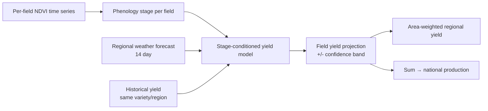

Every dashboard above the field level (Estate Group, Regional Forecast, National Overview) is a **rollup** of the same per-field data described in the [Data Model](/concepts/data-model) and [Risk Model](/concepts/risk-model). No new sensors, no new events, no new rule cards. Only aggregation.

This page defines the aggregation contract: what each metric means at each layer, how it is combined, and what confidence you can attach to the answer.

<Note>
  If a metric is not defined here for the layer you care about, it is not shown on the dashboard. We refuse to fabricate rollups from missing data.
</Note>

## Layers

| Layer | Scope | Primary user | Refresh cadence |
| --- | --- | --- | --- |
| **Field** | One managed parcel | Agronomist, scout | Per satellite pass (3-7 days) |
| **Estate Group** | A named collection of fields (single owner) | Estate manager, operations lead | Daily rollup at 06:00 local |
| **Regional Forecast** | Administrative region (state, division, district) | Regional agency, cooperative | Weekly rollup, Monday 06:00 local |
| **National Overview** | Whole country | Ministry, national planner | Weekly rollup, Monday 08:00 local |

Higher layers **never** query field-level data live. They read pre-computed rollups written by a scheduled job. This keeps executive dashboards fast and predictable, and it makes the aggregation reproducible for audit.

## Rollup categories

Each metric on a higher-layer dashboard belongs to one of five categories. The category decides how it aggregates.

| Category | Examples | Aggregation rule |
| --- | --- | --- |
| **Extensive** | Hectares monitored, production forecast (t), value (RM), active alerts count | **Sum** across children |
| **Intensive (area-weighted)** | NDVI mean, NDMI mean, yield-per-hectare | **Sum(metric × area) / Sum(area)** |
| **Distribution** | % healthy / stressed / critical | **Sum(area in bucket) / Sum(total area)** |
| **Rate** | Response rate to alerts, verification acceptance rate | **Sum(numerator events) / Sum(denominator events)** |
| **Categorical rollup** | Dominant crop, dominant hazard | **Argmax by area** with tie-break to most recent |

<Warning>
  Never average an average. NDVI at estate level is `sum(NDVI_field × area_field) / sum(area_field)`, never `mean(NDVI_field)`. Mixing the two silently biases small fields upward.
</Warning>

## What rolls up cleanly, and what does not

<CardGroup cols={2}>
  <Card title="Rolls up cleanly" icon="circle-check">
    - Area totals
    - Area-weighted indices (NDVI, NDMI, NDRE)
    - Health distribution buckets
    - Alert counts by severity and category
    - Production forecast (yield-per-ha × area)
    - Verification counts and acceptance rate
  </Card>

  <Card title="Does not roll up" icon="circle-xmark">
    - Individual rule card severity (a field is HIGH; the estate is not)
    - Scout task assignees (person-level, not areal)
    - Specific VRA prescriptions (field-specific)
    - Named recommendations (rule cards fire per field, not per estate)
  </Card>
</CardGroup>

Everything in the right column stays at field level. Higher layers see **counts and rates** of these items, not the items themselves. An estate dashboard shows "12 fields at HIGH blast risk", not a merged "estate blast risk" (which would be meaningless).

## Forecast layer

Regional Forecast and National Overview add a **forecast** on top of the rollup. This is where satellite phenology, weather, and historical yield combine to project production forward.

The forecast is **not** a single point. Every projection carries:

- **Central estimate** - the median of the yield model output
- **Confidence band** - P10 to P90 range
- **Confidence label** - High, Medium, Low, based on the drivers listed below

### Confidence degradation

Confidence is highest at the field level and drops as you climb. Reasons:

| Factor | Effect on higher-layer confidence |
| --- | --- |
| Coverage gaps (cloud, missing imagery) | Lower confidence; band widens |
| Rule card version drift across children | Lower confidence; mixed rule versions flagged in the UI |
| Missing phenology stage for a share of area | Lower confidence proportional to missing area |
| Weather forecast horizon past 7 days | Confidence label drops one step |
| Variety mix unknown for a share of area | Confidence label drops one step |

The **Confidence** chip on every regional and national card is the minimum of its input chips. One weak input drags the whole answer down. This is intentional. Executives should see the weakest link, not an optimistic average.

## Refresh, freshness, and lag

Every rollup card shows a `Last updated` timestamp and a `Data through` timestamp. They are not the same.

- **Last updated** - when the aggregation job wrote this rollup
- **Data through** - the newest field observation that was included

If a rollup's `Data through` is more than one refresh cycle behind expected, the card renders a **Stale** badge. Common causes:

1. Persistent cloud cover blocking imagery for a share of area ("cloud debt")
2. Fields with paused monitoring (billing, subscription, or manual pause)
3. Rule card upgrade in progress: fields still on old rule versions are excluded until they migrate

Stale rollups are always visible; they are never hidden. Hiding them would let a stakeholder mistake old data for the current state.

## Privacy and access rules

Aggregation does **not** relax field-level access rules. If a viewer cannot see field A directly, field A's contribution is:

- **Included** in extensive sums and area-weighted means (the viewer sees the aggregate number)
- **Excluded** from any drilldown, list, filter, or export that would reveal per-field identity
- **Excluded** from any bucket smaller than the **k-anonymity threshold** (default `k = 5`). If a regional slice contains fewer than 5 fields, that slice collapses into "Other" until the count is met.

This is how a National Overview can show correct national totals while keeping any individual estate's performance private from other estates.

## Reproducibility

Every rollup card can be **explained**: click any number and the platform shows:

1. The list of child rollups that fed into it
2. The aggregation rule that was applied (sum, area-weighted mean, etc.)
3. The rollup job's run timestamp and the input `Data through` cutoff
4. Any children that were **excluded** and why (stale, paused, k-anon threshold, missing phenology)

The same explanation is embedded in every [Verification](/guides/verification) bundle exported at the estate, regional, or national layer. Agencies and auditors reproduce numbers from the same inputs.

## Related

- [Data Model](/concepts/data-model) - the field-level schema everything rolls up from.
- [Risk Model](/concepts/risk-model) - rule cards fire per field; higher layers see counts and rates.
- [Verification Model](/concepts/verification-model) - how aggregated numbers stay auditable.
- [Estate Group](/guides/estate-group), [Regional Forecast](/guides/regional-forecast), [National Overview](/guides/national-overview) - the three dashboards that consume this contract.