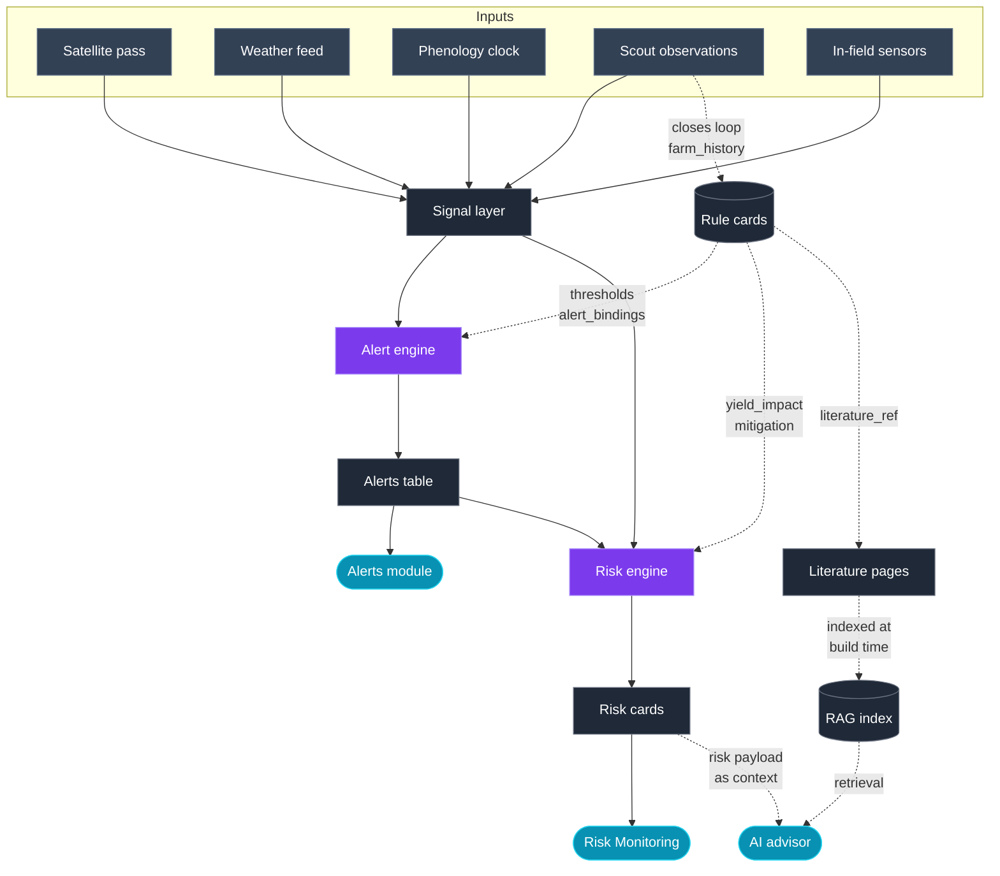

The Alerts and Risk Monitoring modules do not run on prose. They run on a structured layer that sits between raw signals (indices, weather, phenology) and the diagnosis pages in this documentation. That layer is a library of **rule cards**: one machine-readable file per stress, disease, pest, or nutrient disorder, each backed by a full literature page.

This page documents the model so agronomists, engineers, and integrators share the same vocabulary.

## The four layers

<CardGroup cols={2}>
  <Card title="1. Signal layer" icon="satellite-dish">
    Continuously ingested inputs: vegetation indices (NDVI, NDRE, NDMI, LST, CWSI, Salinity Index), weather observations and forecasts (temp, humidity, leaf-wetness hours, rainfall, ET), phenology (days after sowing or transplanting, derived stage), and optional in-field sensors and scout observations.
  </Card>

  <Card title="2. Rule cards" icon="file-code">
    One YAML card per condition (e.g. `rice_blast`, `rice_water_stress`, `rice_bph`). Each card lists the crop, valid stage window, driver thresholds, severity formula, yield-impact curve, mitigation window, and recommended actions. Every card links back to its literature page.
  </Card>

  <Card title="3. Engines" icon="gears">
    The **alert engine** fires on threshold crossings against the signal layer. The **risk engine** matches active alerts \+ forecasts against rule cards to produce forward-looking risk cards with yield-at-risk, estimated loss, and days to mitigate.
  </Card>

  <Card title="4. AI advisor" icon="sparkles">
    Retrieval-augmented generation over the literature. Given an alert or risk payload, the advisor retrieves the matching rule card and diagnosis page and returns a grounded answer with four fixed sections: what's happening, parameters, what to do, how to do it.
  </Card>
</CardGroup>

## Data flow



**How to read this diagram**

- **Solid arrows** are data movement: satellite pass to risk card to grounded answer.
- **Dashed arrows** are references or lookups (rule cards being read, RAG retrieval, cross-links).
- **Rule cards feed both engines, never the other way around.** The alert engine reads driver thresholds and `alert_bindings`; the risk engine reads the same cards plus `yield_impact` and `mitigation`. Cards are inputs, not outputs.
- **Literature pages feed the RAG index at build time,** not at query time. The advisor queries the index, then references the underlying pages via `literature_ref` on the rule card.
- **The risk card is passed to the advisor as context** when the user clicks **Ask the advisor**, so the LLM sees the same numbers the operator sees.
- **Scout observations close the loop** back into the signal layer and into `farm_history` calibration for the next season.

## Rule card schema

Rule cards live alongside their literature page as YAML frontmatter under a `rule_card:` key, so a single `.mdx` file is both human-readable documentation and the source of truth for the engines.

```yaml
rule_card:
  id: rice_blast                    # unique, snake_case
  crop: rice                        # rice | oil_palm | pineapple | rubber | any
                                    # or an array, e.g. [rice, oil_palm], for
                                    # cross-crop hazards (drought, submergence)
                                    # combined with cycle_model_filter for narrowing
  category: biotic.disease          # biotic.disease | biotic.insect | biotic.weed |
                                    # abiotic | nutrient
  stage_window:                     # phenology stages when this rule is active
    - tillering
    - booting
    - heading

  season_type_filter:               # optional. cyclical crops only. Fire only in
    include:                        # matching Season Types; omit to fire in any.
      - "Off Season"                # e.g., BLB pressure is higher in Off Season.

  drivers:                          # inputs the engine evaluates
    - name: leaf_wetness_hours_7d
      op: ">"
      value: 40
      weight: 0.35
    - name: night_temp_min_c
      op: "between"
      value: [20, 28]
      weight: 0.25
    - name: ndre_anomaly
      op: "<"
      value: -0.05
      weight: 0.20
    - name: n_application_recent
      op: "=="
      value: true
      weight: 0.20

  severity:                         # how driver hits combine into a severity score
    formula: weighted_sum           # weighted_sum | max | logistic
    bands:
      low:    [0.0, 0.35]
      medium: [0.35, 0.65]
      high:   [0.65, 1.0]

  yield_impact:                     # per-stage loss curve, % of expected yield
    default:                        # v0 - crop-only baseline, ships with platform
      tillering: { low: 2,  medium: 6,  high: 12 }
      booting:   { low: 5,  medium: 15, high: 30 }
      heading:   { low: 8,  medium: 20, high: 45 }
    by_ecosystem:                   # v1 - overrides default when field ecosystem is set
      rainfed_upland:
        tillering: { low: 4,  medium: 10, high: 20 }
        booting:   { low: 8,  medium: 22, high: 40 }
        heading:   { low: 12, medium: 28, high: 55 }
      irrigated_lowland:
        tillering: { low: 2,  medium: 5,  high: 10 }
        booting:   { low: 4,  medium: 12, high: 25 }
        heading:   { low: 6,  medium: 16, high: 38 }
    by_variety_group:               # v2 - multiplier on the resolved row
      susceptible:          { multiplier: 1.3 }
      moderately_resistant: { multiplier: 0.7 }
      resistant:            { multiplier: 0.4 }
    source: literature_v0           # provenance
    citations:
      - "IRRI Rice Knowledge Bank - Blast"
      - "FAO Rice Production Manual"

  mitigation:
    window_days_by_severity:        # honest countdown - tightens as risk rises
      low: 10
      medium: 7
      high: 3
    window_days_stage_modifier:     # optional: shorten window at critical stages
      heading: -2
    actions:                        # ordered, most-preferred first
      - id: preventive_fungicide
        label: "Preventive fungicide (tricyclazole or isoprothiolane)"
        when: "dry weather window within 5 days"
      - id: scout_susceptible_blocks
        label: "Scout susceptible blocks; confirm before spraying"
      - id: reduce_n_split
        label: "Hold remaining N split until risk clears"

  alert_bindings:                   # which alert types can precede this risk
    - ndvi_drop
    - weather.humidity_high
    - weather.night_temp_low

  activity_bindings:                # how team activity affects this rule (see Activity & Alerts)
    - event: scout.completed
      when: "lesions_confirmed == true"
      effect: promote_severity      # one band up
      escalate_to: critical
    - event: scout.completed
      when: "lesions_confirmed == false"
      effect: raise_contradiction   # signal vs ground truth disagree
    - event: task.overdue
      when: "stage in [booting, heading]"
      effect: promote_severity
    - event: map.applied
      when: "map.type == fungicide"
      effect: reset_severity        # mitigation applied; recompute from fresh signals

  literature_ref: /guides/Crop/Rice/biotic/diseases/blast
  last_reviewed: 2026-06-01
  reviewer: agronomy-team
```

### Field reference

| Field | Purpose |
| --- | --- |
| `id` | Stable identifier used by the engine, API, and advisor. |
| `crop`, `category` | Route the rule to the right crop and section of the literature. |
| `stage_window` | Gates evaluation to the phenology stages where the rule is meaningful. A booting-stage rule should not fire at emergence. |
| `season_type_filter` | Optional. Cyclical crops only. Fires only inside matching Season Types (e.g., `Off Season` for hazards concentrated in that cycle). Omit to fire in any Season Type. See [Crop Cycle Models](/concepts/crop-cycle-models). |
| `drivers` | Machine-readable version of the "How it shows in satellite data" and "When rice is most vulnerable" sections. Each driver names a signal, comparison operator, threshold, and weight. |
| `severity` | Converts driver hits into a normalized score and severity band (low / medium / high) surfaced on the Risk Monitoring card. |
| `yield_impact` | Layered per-stage loss table. Used to compute "yield at risk %" and "estimated loss (t)" once field area and expected yield are known. See [Yield-impact layers](#yield-impact-layers) below. |
| `mitigation.window_days_by_severity` | Powers the "days to mitigate" number on the risk card. The engine picks the row that matches the current severity band (`low`, `medium`, `high`), then applies any `window_days_stage_modifier` for the current stage. |
| `mitigation.actions` | Ordered playbook. The top item becomes the primary CTA ("Open scout task"). |
| `alert_bindings` | Which data-driven alert types promote this rule from dormant to active for a field. |
| `activity_bindings` | How team activity (scout completions, overdue tasks, applied maps) changes this rule's severity. See [Activity bindings](#activity-bindings) below and [Activity & Alerts](/guides/activity-and-alerts). |
| `literature_ref` | Path the AI advisor retrieves when the user clicks **Ask the advisor**. |
| `last_reviewed`, `reviewer` | Governance. Cards older than 12 months are flagged for agronomist review. |

## How a risk card is produced

<Steps>
  <Step title="Alerts fire from the signal layer">
    Example: `A2 water stress unresolved` (NDMI 0.19 below 0.30 healthy band) and `night_temp_low` from the weather forecast.
  </Step>
  <Step title="Risk engine matches active rule cards">
    For field A2 (rice, booting stage), the engine loads all rule cards where `crop = rice` and `stage_window` contains `booting`, then evaluates each card's `drivers` against the current signal state.
  </Step>
  <Step title="Severity and impact are computed">
    The `severity.formula` produces a score (e.g. 0.72 → **HIGH**). The engine resolves `yield_impact` layer by layer for this field: if `ecosystem = irrigated_lowland` and `variety_group = susceptible`, it takes `by_ecosystem.irrigated_lowland.booting.high = 25%`, then applies the susceptible multiplier `× 1.3 = 32.5%`. Multiplied by the field's expected yield and area, this becomes `~5.8 t estimated loss`.
  </Step>
  <Step title="Mitigation window is resolved">
    The engine reads `mitigation.window_days_by_severity[high] = 3` and applies any `window_days_stage_modifier` for the current stage. This becomes the "Days to mitigate" number on the card.
  </Step>
  <Step title="Risk card is rendered">
    The Risk Monitoring module displays hazard, driver summary, yield-at-risk %, estimated loss, `mitigation.window_days`, and the top action from `mitigation.actions`.
  </Step>
  <Step title="AI advisor grounds its answer">
    Clicking **Ask the advisor** sends the risk payload plus the referenced literature page to the LLM with a fixed output schema: `whats_happening`, `parameters`, `what_to_do`, `how_to_do`.
  </Step>
</Steps>

## Yield-impact layers

A single flat yield-loss table is never right for every field. The same disease behaves very differently across ecosystems and varieties. `yield_impact` is therefore a **layered lookup**, from most general to most specific. The engine resolves them in order, and the first match wins:

```text
farm_history  →  region  →  variety + ecosystem  →  ecosystem  →  default
    (v4)          (v3)              (v2)              (v1)         (v0)
```

| Layer | Ships when | Why it matters | Example |
| --- | --- | --- | --- |
| **`default`** (v0) | Day one, with the platform. | Baseline curve per crop, sourced from published literature. Enough to launch Risk Monitoring. | Rice blast at heading peaks at ~45% loss (IRRI reference). |
| **`by_ecosystem`** (v1) | Highest-value refinement. Ship for the top 3-5 rules per crop. | Same disease behaves very differently across water regimes. Rainfed uplands see far higher blast pressure than irrigated lowlands. | See [Rice Ecosystems](/guides/Crop/Rice/rice-ecosystems). |
| **`by_variety_group`** (v2) | Once the field data model captures `variety_group`. Applied as a multiplier on the resolved row, not a full override. | Resistant vs susceptible changes losses by 3-5x. Group is enough; exact variety not required. | `susceptible`, `moderately_resistant`, `resistant`. |
| **`by_region`** (v3) | Once regional pathogen and weather patterns are characterized. | Local pathogen races and micro-climates. | `PH-Luzon`, `VN-Mekong`. |
| **`farm_history`** (v4) | Auto-tuned by the platform after 1-2 seasons of observations. | The platform's own record of what actually happened on this farm. | Learned, not authored. |

<Tip>
  Ship v0 for every rule this quarter. Add v1 (ecosystem) for the top 3-5 rules per crop next. Do not block the module launch on v3 or v4 - they are refinements, not prerequisites.
</Tip>

### Ecosystem is a field-data prerequisite

For crops where ecosystem meaningfully changes risk (rice is the clearest example), `ecosystem` must be a captured property on the field before the risk engine can apply v1 overrides. If the field record is missing an ecosystem tag, the engine falls back to `default` and marks the risk card as "baseline estimate" so the operator knows precision is limited.

For crops where ecosystem is less discriminating (oil palm, pineapple, rubber), use `by_region` or `by_soil_type` in place of `by_ecosystem`. The layer key is generic on purpose.

### Provenance and governance

Every `yield_impact` block carries `source` and `citations`. Values are one of:

- `literature_v0` - drawn from published references (IRRI, FAO, national extension).
- `agronomy_reviewed` - validated by the internal agronomy team.
- `farm_calibrated` - refined against the platform's own field-history observations.

Cards flagged `literature_v0` are surfaced in the agronomy review queue and re-checked annually.

## Agronomic rate bands

The Alerts and Risk engines produce prescriptions. Before a prescription can be exported or applied, the [VRA Maps](/guides/prescription-maps) **Input validation** guardrail requires every per-zone rate to fall inside a crop-specific agronomic band. The [Semai Advisor](/guides/semai-advisor/overview) uses the same band as its safety-critical write gate, and [Failure Modes](/guides/semai-advisor/failure-modes) trips a degradation when a requested rate would exceed it. Those three references land here.

A band is one row keyed on **crop × product** with a **minimum**, a **maximum**, a **unit**, a **basis** (per pass, per season, or per year), and a **source**. Anything else is out of scope for this table: recommended rate curves live in the crop diagnosis pages, not here. This is the refusal boundary, not the recipe.

### Units policy

Every band on this page is stated in **kg of product per hectare** (`kg product/ha`), never kg of nutrient. The two differ by the product's nutrient fraction (urea is ~46% N, MOP is ~60% K₂O, kieserite is ~27% MgO), and a validator that silently accepts one for the other corrupts every rate it passes. Where a Malaysian source publishes a recommendation in kg nutrient/ha, the conversion to the specified product form is applied and the source figure is preserved in the citation.

Two exceptions, both explicit:

- **Ethephon (pineapple forcing)** is stated in **mL of formulated product per plant** at the labelled active-ingredient concentration, because that is how the Malaysian label directs it and how it is applied. It is not a hectare rate.
- **Foliar borate on oil palm** is stated in **g product per palm**, because MPOB extension publishes it per palm and per-hectare conversion depends on stand density.

The unit is part of the band. A prescription submitted in a different unit is rejected before the min/max check even runs.

### Basis: per pass, per season, per year

Sources publish rates on three different time bases and they are not interchangeable:

- **Per pass** — a single application event. This is what the prescription file actually executes. VRA validation compares against this basis.
- **Per season** — the whole-crop-cycle total, split across passes. Used by DOA and MARDI for rice.
- **Per year** — the annual total for perennials. Used by MPOB for oil palm and RRIM for rubber, typically split across 2-4 rounds.

**A season or annual total is never validated as a single-pass rate.** Where the sourced figure is a season or annual total, the band declares that basis, and the platform derives a per-pass ceiling from `total / expected_passes` for the field's declared application schedule. Fields without a declared schedule fall back to a conservative per-pass cap of `total / 3` (rice) or `total / 4` (oil palm, rubber), documented on the field record so the operator knows what is being enforced.

### Stage and tier keying

Two structural decisions the handoff called out explicitly:

- **Growth stage.** Rice N at tillering and rice N at panicle initiation are different recommendations. Where a source gives stage-specific rates, the band carries a `by_stage` map with a `default` fallback, identical in shape to `yield_impact.by_ecosystem`. Where a source only gives a season total, the band carries `basis: season` and the per-pass derivation above applies; no stage keying is invented.
- **Ecosystem and variety.** These are the same tiers the yield-impact resolver already uses. Where a Malaysian source distinguishes (for example, MPOB's inland-mineral vs coastal-clay vs peat soil groups; DOA's granary-scheme differences), the band carries `by_ecosystem` or `by_soil_group` in the same layered-lookup shape. Where the source does not distinguish, the band carries a single row and the resolver returns it for every tier. No parallel structure is introduced.

### Band schema

Bands live in `product_bands.yml` alongside the rule cards. One entry per crop-product pair.

```yaml
product_bands:
  - id: rice_urea                    # snake_case, human-readable
    crop: rice
    product: urea
    unit: kg_product_per_ha
    basis: season                    # per_pass | season | year
    expected_passes_default: 3       # used to derive per-pass cap when basis != per_pass
    band:
      min: ~                         # kg product/ha, season total
      max: ~
    by_ecosystem:                    # optional; same shape as yield_impact.by_ecosystem
      irrigated_lowland:
        band: { min: ~, max: ~ }
      rainfed_lowland:
        band: { min: ~, max: ~ }
    by_stage:                        # optional; only when the source is stage-specific
      tillering:      { min: ~, max: ~ }
      panicle_init:   { min: ~, max: ~ }
    source: ~                        # "MARDI Rice Check", "DOA Fertiliser Guideline 2019", etc.
    citation: ~                      # exact document + page/section
    status: decision_required        # sourced | decision_required | undefined
    last_reviewed: ~
    reviewer: agronomy-team
```

### Bands

<Warning>
  **Every band below is `status: decision_required`.** No Malaysian primary sources (MPOB, MARDI, DOA, RRIM / Malaysian Rubber Board) were available in this drafting session to attribute a defensible min/max per figure. This section establishes the schema, unit policy, and fail-closed rule so the three consuming pages have a live target. **The numeric bands themselves must be filled by an agronomist with the primary documents in hand, one row at a time, and marked `sourced` with an exact citation before validation is enabled in production.**

  Until each row is marked `sourced`, the platform treats it as undefined and applies the fail-closed rule below.
</Warning>

| Crop | Product | Unit | Basis | Min | Max | Source | Status |
| --- | --- | --- | --- | --- | --- | --- | --- |
| Rice | Urea (46-0-0) | kg product/ha | season | — | — | MARDI / DOA fertiliser recommendation; MADA and KADA scheme guidance | Decision required |
| Rice | NPK compound (e.g. 15:15:15) | kg product/ha | season | — | — | MARDI / DOA; specify which compound formulation | Decision required |
| Rice | TSP or CIRP (phosphorus source) | kg product/ha | season | — | — | MARDI / DOA | Decision required |
| Rice | MOP (60% K₂O) | kg product/ha | season | — | — | MARDI / DOA | Decision required |
| Oil palm | Urea or ammonium sulphate | kg product/ha/yr | year | — | — | MPOB Oil Palm Bulletin fertiliser recommendation, by soil group | Decision required |
| Oil palm | MOP (60% K₂O) | kg product/ha/yr | year | — | — | MPOB, by soil group (inland mineral / coastal clay / peat) | Decision required |
| Oil palm | Kieserite (27% MgO) | kg product/ha/yr | year | — | — | MPOB, by soil group | Decision required |
| Oil palm | Sodium borate / Fertibor | g product/palm/yr | year | — | — | MPOB extension leaflet on boron; stand density noted on field record | Decision required |
| Rubber | Urea or ammonium sulphate | kg product/ha/yr | year | — | — | RRIM 1000-series / Malaysian Rubber Board, by soil type and tapping status | Decision required |
| Rubber | TSP or CIRP | kg product/ha/yr | year | — | — | RRIM / MRB | Decision required |
| Rubber | MOP | kg product/ha/yr | year | — | — | RRIM / MRB | Decision required |
| Pineapple | Urea or ammonium sulphate | kg product/ha/cycle | season | — | — | MARDI pineapple production manual (MD2 / Josapine / Moris) | Decision required |
| Pineapple | MOP | kg product/ha/cycle | season | — | — | MARDI | Decision required |
| Pineapple | Ethephon (forcing) | mL product/plant | per\_pass | — | — | Malaysian label rate and MARDI forcing protocol; note active-ingredient concentration | Decision required |

**Decision required** (surfaced explicitly so they are not lost in the table):

- _Decision required: For rice, does MARDI/DOA publish stage-specific N min/max (tillering, panicle initiation), or only a season total?_ This determines whether the band uses `by_stage` or `basis: season` with per-pass derivation.
- _Decision required: For oil palm N, K, and Mg, does MPOB publish bands by soil group (inland mineral, coastal clay, peat), or a single band?_ This determines whether the row uses `by_ecosystem` / `by_soil_group` or a flat band.
- _Decision required: For rubber, do RRIM recommendations distinguish immature (pre-tapping) vs mature (tapped) stands within the min/max, or only in the recommended rate?_ Stands change the band, not just the recipe.
- _Decision required: For pineapple ethephon, is there a Malaysian primary source (MARDI or the product label registered with Department of Agriculture) that publishes a maximum per-plant dose that can be defended, or should this product be left undefined and therefore refused?_ If no defensible source, leave undefined; the platform will refuse ethephon prescriptions rather than accept any rate.
- _Decision required: For every row above, the exact citation (document title, year, page or section) that will be recorded on the band. Recommendations change across MARDI/DOA/MPOB revisions; the band must name the revision it comes from._

### Fail-closed rule for undefined combinations

**Where no band exists for a crop and product, the platform declines the prescription. It does not fall back to "any rate is acceptable."** This is the rule that keeps the guardrail honest while the table is being filled in.

Concretely:

- The VRA Maps **Input validation** guardrail rejects a prescription whose `(crop, product)` pair has no `product_bands` entry, or has an entry with `status: decision_required` or `status: undefined`. The rejection cites the missing band by id and links here.
- The Semai Advisor treats the same missing band as a **hard refusal**, not a confirmation prompt. Confirmation only applies where a band exists and the requested rate is outside it. Where no band exists at all, the advisor refuses and states which band is missing.
- The Failure Modes trigger _"requests an action that would exceed agronomic min/max rates"_ extends to _"requests an action for a crop-product pair with no defined band."_ Both fire the same degradation.

A missing guardrail fails closed. That is the difference between _we have not sourced this yet_ and _any rate is acceptable here_, and the second one puts fertiliser on the ground.

### Attribution: the second route to a permitted rate

The rule above is correct and it has a consequence worth stating plainly: **while every band is `decision_required`, the guardrail permits nothing.** A guardrail that has never let a prescription through is not yet a working feature, and the table may stay unfilled for a long time — no Malaysian authority publishes a min/max for any crop-product pair, only point recommendations.

So there are **two routes to a permitted rate**, and only two:

| Route | Condition | What the platform is claiming |
| --- | --- | --- |
| **Validated** | A `sourced` band exists and the rate falls inside it | _This rate is within a published recommendation, and here is the citation._ |
| **Attributed** | No band exists, and the rate carries a named author who was entitled to set it | _Nobody has published a range for this. **A named person decided this figure**, on this date, for this map._ |

**A rate with neither a band nor an author is still refused.** That is the fail-closed rule, unchanged. What changes is that _no source_ and _no accountability_ stop being the same condition.

#### What an attributed rate must carry

Every attributed rate records `set_by`, `set_by_role`, `set_at`, and a stated reason. These are **not** a band: a band is a range that validates many prescriptions, and an attributed rate is one figure on one map. **Do not add a fifth `status` value to the bands table for this** — the band stays `decision_required` until somebody sources it, and attribution is recorded on the prescription instead.

#### Attribution never substitutes for a regulatory limit

**Attributed rates apply to fertiliser and soil amendments only.** They are refused, regardless of who signs, for:

- **restricted products** — pesticides and high-nitrogen formulations, per the existing safety floor on [VRA Maps](/guides/prescription-maps);
- **anything constrained by regulation rather than agronomy** — buffer zones near waterways, regulated boundaries, and statutory maximum application rates.

Where the constraint is law, a name is not authority. The safety floor is unchanged by this section.

#### An attributed rate does not become a default

A figure entered once will be copied to the next map, and to the one after that, until it is a house standard nobody has read the reasoning for. That is the same fabricated default this page refuses, arrived at by drift instead of by decision.

**So a rate carried forward from an earlier map carries its origin with it** — who set it, when, and on which map — and the reader is told it is being reused rather than decided. Reuse is not authorship.

#### The difference is visible where the rate is used

A **sourced** rate and an **attributed** rate must be distinguishable **on the prescription itself**, not only in a settings table. The bands table will hold a mix for a long time — the one genuine published range found to date is ethephon on pineapple — and a citation and a judgement that look identical at the point of use are worse than either alone.

The wording changes with the route, and both remain answers:

- **No band, no author** — _"No published recommendation exists for this crop and product, and nobody has set a rate for it. This prescription is refused."_
- **No band, named author** — _"This rate is not sourced from any published recommendation. It was set by Siti Rahman on 3 August and applies to this map only."_

#### Who may set one

**Decision required: which functional roles may set an attributed rate.** The role matrix on [VRA Maps](/guides/prescription-maps) names Operator, Agronomist, Approver/Manager and Read-only, and **`Operator` is not one of the eight functional roles** in the [role model](/snippets/role-model). That mismatch has to be resolved before attribution can be enforced, because the entitlement is the whole of the guardrail.

### Provenance

Each row on the bands table carries the same provenance tags as `yield_impact`:

- `sourced` — attributed to a named Malaysian primary source with an exact citation. Enforced.
- `decision_required` — schema exists, numbers do not. Rejected by the fail-closed rule.
- `undefined` — the agronomy team has explicitly declined to publish a band for this pair (e.g. product not supported in Malaysia, or no defensible source). Rejected by the fail-closed rule with an explanatory message.
- `agronomy_reviewed` — a band adjusted from the primary source by the internal agronomy team, with rationale recorded.

Bands, like rule cards, are re-checked annually and whenever the underlying Malaysian source publishes a revision.

## Docs Delta

New section on this page: **Agronomic rate bands** (schema, units policy, basis rules, stage and tier keying, band table, fail-closed rule, provenance).

The following pre-existing references now resolve to a live definition on this page:

- [VRA Maps](/guides/prescription-maps) — Input validation and Refusals rows in the guardrails table. "Rates must fall within the crop-specific agronomic min/max declared in the Risk Model" now points at the bands table above.
- [Semai Advisor overview](/guides/semai-advisor/overview) — safety-critical writes list. "Rates outside agronomic min/max" now resolves to the same bands.
- [Semai Advisor failure modes](/guides/semai-advisor/failure-modes) — degradation trigger for "exceed agronomic min/max rates" now resolves to the same bands.

**Fail-closed rule** (repeated here so it is not lost inside the section): a crop-product pair with no `sourced` band and **no named author** produces a refusal, not a silent pass. This applies to VRA validation, Semai Advisor writes, and the failure-modes trigger, uniformly.

**Attribution** is the second route, added above: where no band exists, a rate may proceed if it carries a named author who was entitled to set it, and it is then rendered as a judgement rather than as a citation. **It does not apply to restricted products or to anything constrained by regulation**, where the safety floor stands unchanged. Two decisions are open and named in that section: which roles may set an attributed rate, and the `Operator` role that appears on `prescription-maps` but not in the role model.

**Not changed:** no new guardrail categories, no new telemetry types. Attribution is recorded on the prescription and does not add a `status` value to the bands table — a band remains `decision_required` until it is sourced.

## Days to mitigate

The "Days to mitigate" number on the risk card is not a static rule constant. It answers a specific question: **how long does the operator have before the recommended action stops being effective?**

The engine resolves it in two steps:

1. Pick the base window from `mitigation.window_days_by_severity` using the current severity band.
2. Add any `window_days_stage_modifier` value for the current phenology stage (usually negative, tightening the window at critical stages like heading or flowering).

```text
window = window_days_by_severity[severity] + stage_modifier[current_stage]
```

A HIGH-severity blast risk at heading with the schema above resolves to `3 + (-2) = 1 day`. That is honest: at heading, once conditions are right for neck blast, the preventive-spray window is very short.

Rules that describe slow-developing conditions (nutrient deficiencies, salinity buildup) can keep windows in the 10-30 day range. Rules for fast-moving weather-driven diseases should tighten aggressively at HIGH severity.

## Activity bindings

`alert_bindings` covers data-driven inputs. `activity_bindings` covers **team activity** - the human side of the platform. Together they let a rule card react to both a falling NDVI and a completed scout report in the same way.

Each binding declares an `event`, an optional `when` condition, and an `effect` on the rule's current severity for a field.

| Event | Fires when | Typical effect |
| --- | --- | --- |
| `scout.completed` | A scout task tied to this field is marked complete. | `promote_severity` if findings confirm the hazard; `raise_contradiction` if they don't. |
| `scout.contradiction` | Scout findings disagree with the current signal reading. | Emit a `scout_contradicts_sensor` alert; freeze severity until re-scouted. |
| `task.overdue` | A scout or mitigation task passes its due date. | `promote_severity`, especially in vulnerable stages. |
| `map.generated` | A VRA / prescription map targeting this hazard is created. | Info only; do not change severity. |
| `map.applied` | A map is confirmed applied in the field. | `reset_severity` and recompute from fresh signals. |
| `sensor.offline` | An in-field sensor feeding this rule drops offline. | `promote_severity` by one band, with reduced confidence. |
| `imagery.skipped` | Cloud cover skipped the expected imagery pass. | Extend `mitigation.window_days` by the imagery gap. |

### Effect vocabulary

| Effect | Meaning |
| --- | --- |
| `promote_severity` | Move up one band on the severity ladder (`low` → `medium` → `high` → `critical`). |
| `demote_severity` | Move down one band. Used when a scout confirms the signal was a false positive. |
| `escalate_to: <band>` | Force severity to a specific band regardless of computed score. |
| `reset_severity` | Recompute severity from the current signal state, ignoring history. |
| `raise_contradiction` | Emit a `scout_contradicts_sensor` alert without changing severity. |
| `freeze` | Hold severity constant until a follow-up event fires. |

Bindings are evaluated in order; the first match applies. All severity changes are logged with the triggering event so operators can audit why a card was promoted.

<Tip>
  Every `activity_bindings` entry becomes a row in the Activity & Alerts feed with a "why this changed" summary. This is the single mechanism that lets a human scout report tighten (or relax) an AI risk forecast.
</Tip>

## Authoring rule cards

1. Start from the existing diagnosis page (for example, [Blast](/guides/Crop/Rice/biotic/diseases/blast)).
2. Extract the numeric thresholds already stated in prose (e.g. "cool nights below 22 C and humidity above 90% for 3\+ nights") into `drivers`.
3. Ask the agronomy team for a per-stage yield-loss table if one is not already published. This is usually the only new content required.
4. Add the `rule_card:` block to the page's frontmatter. The page continues to render normally; the engine reads the block at build time.
5. Set `last_reviewed` to today and open a PR. Cards are validated against a JSON Schema in CI.

<Tip>
  A diagnosis page without a `rule_card:` block is still valuable to users but is invisible to the Alerts and Risk Monitoring engines. Prioritize rule cards for the top 5-10 conditions per crop first.
</Tip>

## What the AI advisor returns

Every advisor response follows the same four-part schema, populated from the rule card and the retrieved literature page:

| Section | Source |
| --- | --- |
| **What's happening** | Risk card summary \+ first paragraph of the literature page. |
| **Parameters** | The `drivers` block, rendered with current values vs thresholds. |
| **What to do** | `mitigation.actions` in order. |
| **How to do it** | Retrieved from the "Reduce the damage by" and field-walk-protocol sections of the literature. |

This structure is what makes the advisor useful in the field: the operator never has to guess whether the AI is speculating or citing your literature.

## Related

- [Vegetation Indices](/concepts/indices) - the signal layer's core inputs.
- [Field Data Model](/concepts/field-data-model) - fields, zones, seasons, observations the engines run against.
- [Alerts](/guides/alerts-notifications) - user-facing alert types and delivery.
- [Rice Blast](/guides/Crop/Rice/biotic/diseases/blast) - reference page with a fully populated `rule_card:` example.
- [Aggregation Model](/concepts/aggregation-model) - how rule card counts and areas roll up to estate, regional, and national dashboards.
- [Fields Workspace](/guides/fields-workspace/overview) - the operator view where rule-card findings are read and acted on.
- [Crop Cycle Models](/concepts/crop-cycle-models) - Season Type vocabulary that `season_type_filter` gates on.