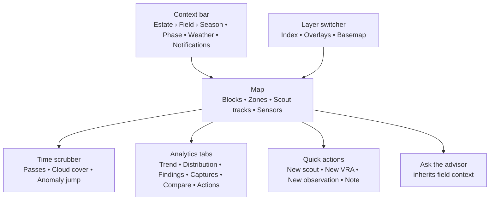

Fields Workspace is the single-field view. It is where an operator or agronomist spends most of their working day. The map is the primary surface; every panel is a lens over the same selected Field, Season, and satellite pass.

<Note>
  Fields Workspace does not introduce a new data model. Everything on screen is a projection of what already exists in [Field Data Model](/concepts/field-data-model), [Risk Model](/concepts/risk-model), and the event stream that powers [Activity & Alerts](/guides/activity-and-alerts) and [Activity Log](/guides/activity-log).
</Note>

## Layout

## The context bar

The strip across the top always shows what the workspace is scoped to. It is the same strip on every workspace view; changing it changes everything below.

| Element | What it shows | Powered by |
| --- | --- | --- |
| **Estate › Field** | Current scope. Click either to switch. | [Field Data Model](/concepts/field-data-model) |
| **Season** | Currently selected crop cycle. Label follows the crop's `cycle_model`: `Main Season 1 . 2026` (rice), `Production Year 2026 . Age 8` (oil palm), `Batch 2026-A . Plant Crop` (pineapple). A **Current** chip appears when it matches today. The picker offers only cycles valid to compare with the current one; see [Crop Cycle Models](/concepts/crop-cycle-models). | Seasons in the [Data Model](/concepts/field-data-model#seasons) |
| **Phase pill** | Phenology stage and week X/Y with "Next: X in ~Y wks". | Phenology clock in the [Risk Model](/concepts/risk-model) |
| **Weather chip** | Short forward-looking hint ("No spray until Sat", "Rainfall only", "Heat wave in 3 d"). This is a mitigation projection, not raw weather. | Weather feed \+ rule-card `mitigation.window_days_stage_modifier` |
| **Notifications bell** | Count of unread items routed by [Notification Preferences](/guides/notification-preferences). | Activity feed |

## The layer switcher

Below the context bar, the layer switcher controls what the map draws.

<CardGroup cols={2}>
  <Card title="Index" icon="layer-group">
    NDVI, NDRE, NDMI, NDWI, LST, CWSI, Salinity. Same list as [Vegetation Indices](/concepts/indices). Each index shows on the map with its own color ramp (`-1` to `+1` for normalized indices) and legend.
  </Card>

  <Card title="Overlays" icon="layer-plus">
    Blocks, Zones (computed or drawn), in-flight and applied VRA maps, scout GPS tracks, sensor pins, verification markers. Toggle any combination.
  </Card>

  <Card title="Basemap" icon="map">
    Satellite (true color), hybrid (satellite \+ labels), or terrain. The basemap does not affect analysis; it is context only.
  </Card>

  <Card title="Blocks scope" icon="filter">
    Show all Blocks, one Block, or a saved multi-Block selection. Everything below the map (indices, trend, findings) rescopes accordingly.
  </Card>
</CardGroup>

## The map

The map is the primary surface. It shows the current index colored per pixel, clipped to the Field boundary, with overlays drawn on top.

- **Click a Block** to open its drilldown: rule cards, active alerts, scout tasks, recent VRA activity, verification history. All information is filtered to that Block for the duration of the click.
- **Click a Zone** (computed cluster) to see per-zone stats: mean index, area, severity rank, and the source pass.
- **Draw** an ad-hoc polygon with the map tool. Draw is transient by default; **Save as Zone** to keep it as a named Zone, or **Promote to Block** if it should persist across seasons. See [Block vs Zone](/concepts/field-data-model#terminology-at-a-glance).
- **Hover** any pixel or Block for a value tooltip with `index name · value · pass date`.

### Quick actions (the FAB)

The floating action button (bottom right) creates work from whatever is currently selected. Every action inherits the current Field, Block, pass date, and active index as context.

| Action | Result |
| --- | --- |
| **New scout task** | Opens the [Field Scouting](/guides/field-scouting) new-task drawer, pre-filled with the selected geometry and any active rule card. |
| **New VRA map** | Opens the [VRA Maps](/guides/prescription-maps) generator on the current index and scope. |
| **New observation** | Log a ground-truth observation (photograph, note, sensor reading) at a map coordinate. Feeds `scout.completed` semantics. |
| **New note** | Free-form note attached to the Field or Block. Not a task; not delivered as a notification. |

## The time scrubber

Below the map, the time scrubber is the second most important control after the layer switcher. It moves the entire workspace to a different pass in the season.

<CardGroup cols={2}>
  <Card title="Pass ticks" icon="calendar-days">
    One tick per satellite pass across the current season. Solid ticks are clear passes; hollow ticks are cloud-blocked. Tick height encodes the pass's mean index value for the Field, so the ridge line is the season's index curve at a glance.
  </Card>

  <Card title="Cloud-cover badge" icon="cloud">
    Selected pass shows `date · XX% clear`. Passes below 50% clear render the map with a striped overlay and disable per-pixel drilldown, because the underlying data is unreliable.
  </Card>

  <Card title="Play / step" icon="play">
    Step forward or back one pass at a time, or play the season as an animation. Useful for spotting when a stress event started.
  </Card>

  <Card title="Anomaly jump" icon="triangle-exclamation">
    The **Anomaly** button jumps to the pass where the selected index deviates most from the seasonal curve. This is the fastest way to answer "when did something go wrong?" without scrubbing manually.
  </Card>
</CardGroup>

<Tip>
  Combine **Anomaly jump** with **Ask the advisor** to get a grounded explanation in two clicks: the anomaly pass becomes the advisor's evidence context, and the response cites the specific rule card that best matches the deviation.
</Tip>

## Analytics tabs

Under the map, six tabs give you different lenses over the same field and season. All are projections of existing data; none introduce new sources.

| Tab | What it answers | Source |
| --- | --- | --- |
| **Trend** | "How did this Field's health evolve?" | Signal layer, plotted with phenology bands |
| **Distribution** | "Is the stress uniform or patchy today?" | Signal layer, per-pixel histogram for the selected pass |
| **Findings** | "What rule cards fired, and where are we now?" | [Risk Model](/concepts/risk-model) matches |
| **Captures** | "Show me every image and upload for this Field." | [Imagery Sources](/concepts/imagery-sources) \+ scout uploads \+ drone media |
| **Compare** | "How does this Field compare to another Field, Block, or season?" | Same signal data, dual-scoped |
| **Actions** | "What did we do here, and what is scheduled?" | Activity Log slice for this Field |

See [Analytics Tabs Reference](/guides/fields-workspace/analytics-tabs) for the full detail of each tab.

## Ask the advisor from the workspace

Every workspace view has an **Ask the advisor** entry point. When invoked from the workspace, the advisor inherits:

- Current Field, Estate, and Season
- Current Block scope (if any)
- Current index and pass date
- Any Zone or drawn polygon selected
- Any active rule-card match on the visible Blocks

The operator does not re-describe context. The advisor answers using the four-part schema documented in [Risk Model](/concepts/risk-model#what-the-ai-advisor-returns): what's happening, parameters, what to do, how to do it.

## Export

Export buttons live in the top-right of the workspace. The current view (map \+ active tab \+ time scrubber position) drives every export.

| Format | Contents |
| --- | --- |
| **PDF** | Map snapshot, active analytics tab, phenology, and the reproducibility footer (data-through timestamps and rule-card versions). Same footer format as the [Aggregation Model](/concepts/aggregation-model#reproducibility) explain-view. |
| **CSV** | Index time series for the current Field or Block scope. |
| **GeoTIFF** | Current index layer for the current pass, in the source projection. |
| **GeoJSON** | Block and Zone boundaries currently visible. |

## Common workflows

<AccordionGroup>
  <Accordion title="Morning stress check">
    Open the workspace on your Field. Confirm **NDMI** as the active index. Scan the map for orange or red Blocks. Click each concerning Block, read the top rule-card finding, hit the FAB to create a scout task or a VRA map. Total time under two minutes per Field.
  </Accordion>

  <Accordion title="Investigate a sudden NDVI drop">
    Switch index to NDVI, click **Anomaly**. The scrubber jumps to the offending pass. Read **Distribution** to see if the drop is uniform (weather / drought) or patchy (biotic / infrastructure). Click **Ask the advisor** to get a grounded read. Assign a scout task from the FAB if the advisor is uncertain.
  </Accordion>

  <Accordion title="Compare this season to last">
    Open the **Compare** tab. Pick the same Field in the previous Season. Overlay the NDVI curves. Look at where the curves diverge and cross-reference with **Actions** for what was done differently. Feeds `farm_history` back into the [Risk Model](/concepts/risk-model#yield-impact-layers).
  </Accordion>

  <Accordion title="Weekly report for the estate manager">
    Set the scrubber to today, the tab to **Trend**, and export as PDF. Includes phenology, NDVI curve with confidence, top findings, and reproducibility footer. Attach directly to a stand-up deck or forward via [Notification Preferences](/guides/notification-preferences) digest.
  </Accordion>
</AccordionGroup>

## Related

- [Analytics Tabs Reference](/guides/fields-workspace/analytics-tabs) - deeper detail on each tab.
- [Field Data Model](/concepts/field-data-model) - Fields, Blocks, Zones, Seasons, Observations.
- [Crop Cycle Models](/concepts/crop-cycle-models) - what the Season pill's label and picker are gated on.
- [Cycle Analysis](/guides/seasonal-analysis) - the retrospective counterpart; the Compare tab uses the same three modes.
- [Risk Model](/concepts/risk-model) - drives Findings and the advisor.
- [Activity Log](/guides/activity-log) - the timeline lens; **Actions** tab is its Field-scoped slice.
- [Field Scouting](/guides/field-scouting) - target of the FAB "New scout task".
- [VRA Maps](/guides/prescription-maps) - target of the FAB "New VRA map".