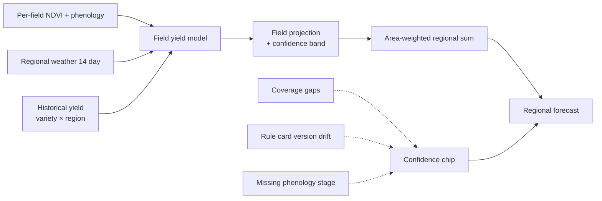

Regional Forecast rolls every field in an administrative region (state, division, district) into one weekly outlook. It is the layer between Estate Group and National Overview, and it is the primary view for **agencies, cooperatives, and regional planners** who do not operate individual fields but do commit resources across many of them.

Every number on this dashboard is defined by the [Aggregation Model](/concepts/aggregation-model). Confidence chips, freshness badges, and drilldown rules all follow that contract.

## What the dashboard shows

<CardGroup cols={2}>
  <Card title="Regional coverage" icon="map">
    Total hectares under monitoring in the region, coverage as a percentage of official planted area (from agency records), and count of estates contributing data.
  </Card>

  <Card title="Production forecast" icon="chart-line">
    Central estimate (tonnes) with P10 to P90 confidence band. Broken down by crop and by the 14-day, 30-day, and end-of-season horizons.
  </Card>

  <Card title="Health distribution map" icon="map-location-dot">
    Choropleth of the region colored by area-weighted health score. Cells with fewer than 5 fields collapse into "Other" for k-anonymity.
  </Card>

  <Card title="Top hazards" icon="triangle-exclamation">
    The five rule cards firing across the largest area in the region this week, with total hectares affected and week-over-week trend.
  </Card>

  <Card title="Weather stress outlook" icon="cloud-bolt">
    14-day weather-driven risk projection: heat units, rainfall deficit or surplus, and flood or drought watch zones.
  </Card>

  <Card title="Response rate" icon="gauge-high">
    Share of alerts issued in the region that received a scout task, VRA action, or verified follow-up within their mitigation window.
  </Card>
</CardGroup>

## How the forecast is produced

The central estimate is an area-weighted sum of per-field yield projections. The confidence chip is the minimum of every input's confidence, so the weakest coverage or freshness signal drives the overall label. See [Aggregation Model - Confidence degradation](/concepts/aggregation-model#confidence-degradation) for the exact rules.

## Refresh cadence

| Item | Refresh |
| --- | --- |
| Health distribution, top hazards | **Monday 06:00 local** (weekly rollup) |
| Production forecast | **Monday 06:00 local**, plus mid-week rerun if a weather forecast shifts materially |
| Weather stress outlook | **Daily 05:00 local** (rides the national weather feed) |
| Response-rate metrics | **Monday 06:00 local** |

All cards show `Last updated` and `Data through`. A stale card is always shown, never hidden.

## Access and privacy

Regional dashboards enforce **k-anonymity with `k = 5`** on every drilldown. If a slice (e.g., a district for a niche crop) has fewer than 5 fields, that slice collapses into "Other" until the threshold is met. Aggregate totals still include those fields; only per-slice drilldown is suppressed.

Regional users **never** see per-field identity for fields outside their own estate group. This is enforced at query time, not just at display time. See [Aggregation Model - Privacy and access rules](/concepts/aggregation-model#privacy-and-access-rules).

## Common workflows

<AccordionGroup>
  <Accordion title="Weekly cooperative briefing">
    Open the region on Monday morning. Read the top-hazard card and the 14-day weather outlook. If any hazard's affected area is growing week-over-week, coordinate a bulk scouting sweep with member estates. Export the dashboard as PDF for the member meeting.
  </Accordion>

  <Accordion title="Early-warning coordination with NADMA">
    When the weather stress card flags a flood watch zone, click through to the affected fields. The regional export bundles all field-level [Verification](/guides/verification) records for the impacted area, ready for pre-emptive NADMA submission.
  </Accordion>

  <Accordion title="Agency subsidy planning">
    Filter production forecast by variety group. The regional total feeds subsidy allocation decisions. Because every input field is verifiable via [Verification Model](/concepts/verification-model), the number holds up in the funding committee.
  </Accordion>

  <Accordion title="Response-rate audit">
    Compare response rate across estates in the region. A persistently low response rate on High alerts is a signal for extension officers to intervene. Drilldown respects estate-level privacy: you see the estate name and rate, not the specific fields.
  </Accordion>
</AccordionGroup>

## What is deliberately excluded

- **Field-level rule cards** - agencies see rule card counts and affected area, not individual field diagnoses.
- **Named scout assignees** - regional users see task counts and completion times, not who did the scouting.
- **VRA prescriptions** - regional users see "X ha with VRA applied this week", not the maps themselves.

If an agency needs field-level detail (e.g., for a specific NADMA claim), it flows through [Verification](/guides/verification) bundles issued by the estate, not through this dashboard.

## Related

- [Aggregation Model](/concepts/aggregation-model) - the rollup contract this page follows.
- [Estate Group](/guides/estate-group) - the layer below.
- [National Overview](/guides/national-overview) - the layer above.
- [Verification](/guides/verification) - how per-field evidence reaches agencies.
- [Risk Model](/concepts/risk-model) - defines the rule cards whose counts appear here.